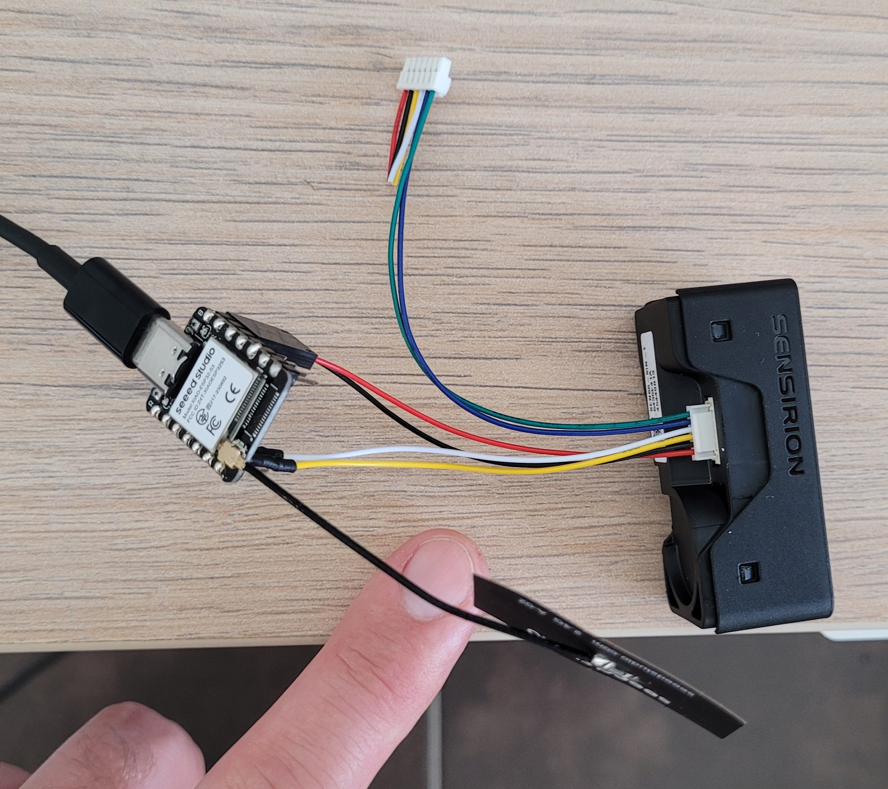

# sensirion-sen66-esp32

This project targets the **Seeed Studio XIAO ESP32‑S3** using PlatformIO. It reads a **Sensirion SEN66** and uploads all available signals to **ThingSpeak** using self written libraries only.

Additionally the firmware can stream measurements to **InfluxDB** and a companion Express.js dashboard located in `/dashboard` visualizes the data on mobile devices.

---

## Getting Started

### 1. Clone the project

```bash
git clone https://github.com/SphaeroX/sensirion-sen66-esp32.git
cd sensirion-sen66-esp32
```

### 2. Configure credentials and channels

1. Copy the environment template and edit your values. All components read from this file.

   ```bash
   cp .env.example .env
   ```

2. Load the variables before building or starting the dashboard:

   ```bash
   set -a; source .env; set +a
   ```

   The PlatformIO build will generate `include/config.h` automatically from these variables.

### 3. I²C pins and speed

Default I²C pins for XIAO ESP32‑S3 are `SDA = 6` and `SCL = 7`. If your wiring differs you can override pins and bus speed in `platformio.ini`.

```ini
; platformio.ini (snippet)
[env:seeed_xiao_esp32s3]
build_flags =
  -DCORE_DEBUG_LEVEL=3
  -DSEN66_I2C_SDA=6
  -DSEN66_I2C_SCL=7
  -DSEN66_I2C_FREQ=100000UL   ; use 400000UL for Fast Mode
```

### 4. Build and upload

```bash
platformio run --target upload
```

After upload open the serial monitor. You should see fresh readings and ThingSpeak update confirmations.

---

## ThingSpeak mapping

The sketch uses two channels. Adjust if you prefer a single channel.

**Channel A**

* field1 → PM1.0 mass \[µg/m³]
* field2 → PM2.5 mass \[µg/m³]
* field3 → PM4.0 mass \[µg/m³]
* field4 → PM10 mass \[µg/m³]
* field5 → Relative Humidity RH \[%]
* field6 → Temperature \[°C]
* field7 → VOC Index
* field8 → NOx Index

**Channel B**

* field1 → CO₂ \[ppm]
* field2 → NC0.5 number concentration \[#/cm³]
* field3 → NC1.0 number concentration \[#/cm³]
* field4 → NC2.5 number concentration \[#/cm³]
* field5 → NC4.0 number concentration \[#/cm³]
* field6 → NC10 number concentration \[#/cm³]
* field7 → Status flags as unsigned integer

ThingSpeak free tier accepts one update at least every 15 seconds. Keep the interval equal or longer to avoid throttling.

---

## What each value means

### PM mass concentrations

**PM1.0**, **PM2.5**, **PM4.0**, **PM10** measure the **mass** of airborne particles inside the respective size fractions. Units are **micrograms per cubic meter**. The sensor reports values for multiple size cuts which lets you see how much dust is present in different bands. A rise in PM2.5 often reflects smoke or fine dust. A rise in PM10 can reflect coarse dust.

Key points

* Mass is dominated by larger particles because mass scales with diameter cubed
* Units: µg per m³
* Good air typically shows low double digit or single digit values indoors

### Number concentrations

**NC0.5**, **NC1.0**, **NC2.5**, **NC4.0**, **NC10** measure **counts of particles** in each size band. Units are **particles per cubic centimeter** written as `#/cm³`.

Key points

* Number is dominated by smaller particles because they are more numerous
* Units: particles per cm³
* This metric responds strongly to ultrafine sources like cooking aerosols or sprays

**PM vs NC**

* PM answers the question how much particulate **mass** is in the air
* NC answers the question how many **particles** are in the air
* You can see high NC with low PM when there are many very small particles with tiny mass
* You can see low NC with high PM when fewer but larger particles carry most of the mass

### Relative Humidity and Temperature

* **RH** is **relative humidity** in percent and shows how much water vapor is present compared to saturation at the same temperature
* **Temperature** is in **degrees Celsius**

These two help you correct interpretation of particle readings. Very high humidity can raise apparent particle mass due to hygroscopic growth in some environments.

### VOC Index

**VOC Index** is a unitless indicator derived from a gas sensor that responds to a broad range of **volatile organic compounds**. Values rise with higher estimated VOC exposure. Interpret the trend over minutes and hours rather than single samples.

Typical use

* Watch for spikes from cleaning agents or paints
* Track decay after ventilation

### NOx Index

**NOx Index** is a unitless indicator related to oxidizing nitrogen compounds from sources like traffic or combustion. Higher values mean higher estimated exposure. Allow a short warm up after power up before you rely on the number.

### CO₂

**CO₂** is reported in **ppm**. It correlates with occupancy and ventilation. Lower is generally better indoors. Many people target values well below 1000 ppm for comfort.

### Status flags

A 32‑bit integer that encodes device status and data validity bits. Zero usually means no warnings. Non zero values can indicate temporary invalid data during warm up or maintenance events. You can log this field to catch rare issues.

### Data validity in the library

The driver checks CRC bytes and treats special raw codes as invalid. For example a raw value that equals the data type maximum is considered not available. Invalid readings become `NaN` in the printed output and are not sent to ThingSpeak fields.

---

## Hardware



* **MCU**: Seeed Studio XIAO ESP32‑S3
* **Sensor**: Sensirion SEN66
* **I²C**: default pins SDA 6 and SCL 7 unless you override in `platformio.ini`
* **Power**: XIAO has on board LiPo charging which is useful for portable logging

Wire SEN66 I²C and power according to the datasheet. Keep leads short for clean signals.

---

## ThingSpeak Data Visualization


---

## Project structure

* `src/` main application
* `lib/` self written libraries `Sen66` and `ThingSpeakClient`
* `include/` configuration headers
* `dashboard/` Express.js server and web dashboard using InfluxDB
* `platformio.ini` PlatformIO configuration

---

## Deploying the dashboard to Azure

The dashboard is an Express.js app and can run on **Azure App Service**.

1. Install dependencies and run the test script:

   ```bash
   cd dashboard
   npm install
   npm test
   ```

2. Deploy using the Azure CLI:

   ```bash
   az login
   az webapp up \
       --runtime "node|18-lts" \
       --name sen66-dashboard \
       --resource-group <RESOURCE_GROUP> \
       --src-path dashboard
   ```

3. Push the environment variables from your `.env` file:

   ```bash
   az webapp config appsettings set \
       --name sen66-dashboard \
       --resource-group <RESOURCE_GROUP> \
       --settings $(cat .env | xargs)
   ```

---

## License

This project is licensed under the MIT License. See `LICENSE` for details.
